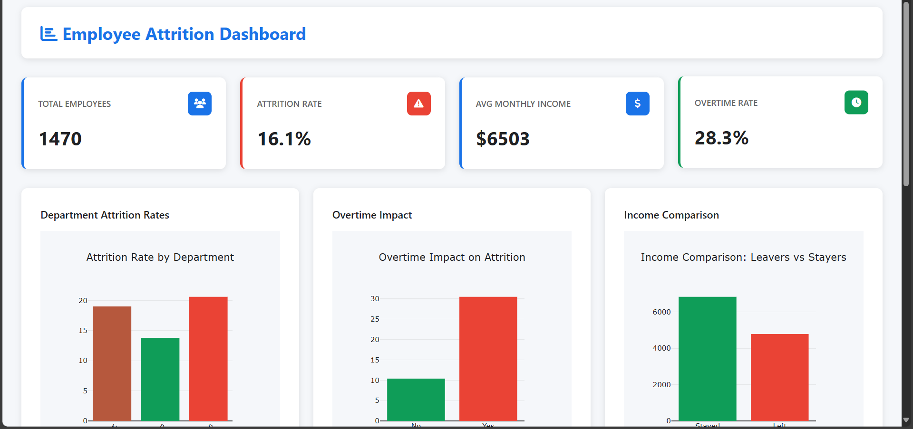
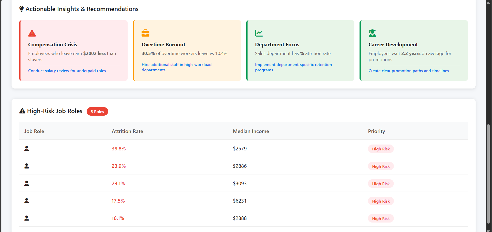

# HR Analytics: Employee Attrition Prediction & Dashboard

---

## Project Overview
This project implements a **comprehensive HR analytics solution** to analyze and predict employee attrition using **machine learning** and **interactive dashboards**.  
It identifies key drivers of employee turnover and provides actionable insights to improve **talent retention** and **HR decision-making**.

---

## Business Problem
Organizations face **unplanned employee turnover** with significant costs:
- Recruitment & training expenses
- Productivity losses
- Disruption in operations

This project addresses the need for **data-driven HR analytics** to:
- Identify high-risk employees
- Diagnose reasons for attrition
- Recommend actionable retention strategies

---

## Key Features
- Predictive modeling with **85.4% accuracy**
- Interactive dashboard for **attrition and workforce insights**
- Department-wise and role-specific risk analysis
- Business insights and HR policy recommendations

---

## Dataset
**IBM HR Analytics Employee Attrition Dataset**
- **Records:** 1,470 employees  
- **Features:** 35 attributes (demographics, compensation, job satisfaction, work-life balance)  
- **Target Variable:** Attrition (Yes/No)  
- **Source:** [Kaggle Dataset](https://www.kaggle.com/datasets/pavansubhasht/ibm-hr-analytics-attrition-dataset)

---

## Technical Architecture

Data Acquisition → Data Preprocessing → Descriptive Analytics →  
Predictive Modeling → Dashboard Development → Business Insights

**Models Used**
| Model               | Accuracy | Key Features                            |
|-------------------- |----------|---------------------------------------- |
| Logistic Regression | 85.4%    | MonthlyIncome, OverTime, JobSatisfaction|
| Random Forest       | 83.7%    | WorkLifeBalance, YearsAtCompany         |

**Tools & Technologies**
- Python, Pandas, NumPy, Scikit-learn  
- Plotly for interactive visualizations  
- Flask for dashboard deployment  
- HTML, CSS, JavaScript for frontend  
- Pickle for model serialization

---

## Analysis & Insights

### Descriptive Analytics
- Total employees: 1,470  
- Attrition rate: 16.1%  
- Average monthly income: $6,502  
- Overtime rate: 28.3%  
- Department distribution: Sales (446), R&D (961), HR (63)

### Diagnostic Analytics
- **Salary gap**: $2,002 less for leavers  
- **Overtime effect**: 30.5% attrition with overtime vs 10.4% without  
- **Department variation**: Sales (20.6%), HR (19%), R&D (13.8%)  
- **High-risk role**: Sales Representatives (39.8% attrition)

### Key Findings
| Factor                  | Impact on Attrition            |
|-------------------------|--------------------------------|
| Overtime                | 3.6x higher risk               |
| Low Job Satisfaction    | 2.1x higher risk               |
| Poor Work-Life Balance  | 1.5x higher risk               |
| Salary Disparity        | 42.7% disadvantage for leavers |
| High-Risk Roles (Sales) | 39.8% attrition                |

---

## Interactive Dashboard
The **Flask-based dashboard** allows:
- Department-wise attrition visualization  
- Overtime & compensation impact analysis  
- Highlighting high-risk roles for HR intervention

**Dashboard Preview**  
  
  

---

## Recommendations

**Immediate Actions (0-3 months)**
- Salary review and adjustment  
- Overtime monitoring and redistribution  
- Retention bonus for high-risk roles

**Medium-term Strategies (3-12 months)**
- Department-specific retention programs  
- Clear promotion pathways  
- Management training for high-attrition teams

**Long-term Initiatives (12+ months)**
- Flexible work arrangements  
- Recognition and reward programs  
- Career development opportunities

---

## Results & Business Impact
- **Attrition prediction accuracy**: 85.4%  
- **Risk quantification**: Overtime employees 3.6x higher attrition risk  
- **Financial ROI**: ~$12M estimated savings from retention programs  

---

## Project Structure

attritionshield/
├── app.py # Flask app
├── model/ # Pickle models
│ ├── logistic_model.pkl
│ └── random_forest.pkl
├── static/ # CSS, JS, images
├── templates/ # HTML templates
├── notebooks/ # Jupyter notebooks
├── data/ # Dataset files
├── src/ # Source code modules
└── requirements.txt # Dependencies

---

## Future Enhancements
- Real-time employee sentiment analysis  
- Integration with live HR systems  
- Advanced deep learning models  
- Mobile-friendly dashboard

---

## Contributors
- **Prathicksha S** 
- [GitHub Profile](https://github.com/prathickshaselvaraj)

---

## License
Educational & demonstration purposes.

---

## Acknowledgments
- IBM HR Analytics Dataset  
- Scikit-learn & Plotly communities  
- Mentors & academic resources

---
